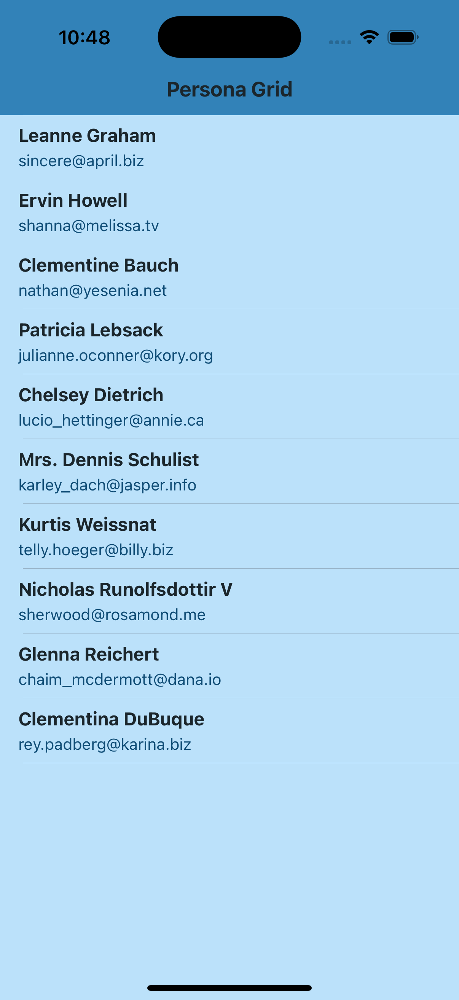
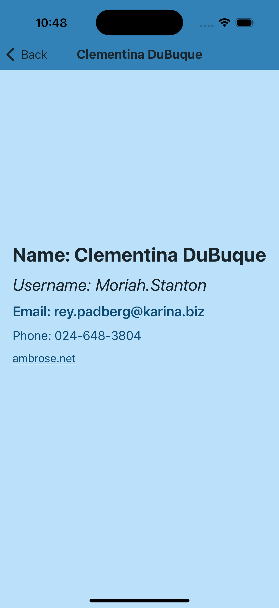

# PersonaGrid

**PersonaGrid** is an iOS application that demonstrates the use of the MVVM (Model-View-ViewModel) architecture with UIKit. The app fetches a list of users from the [JSONPlaceholder API](https://jsonplaceholder.typicode.com/users) and displays them in a user-friendly interface. 

The app has two screens:
1. **User List Screen** - Displays a list of users.
2. **User Details Screen** - Displays detailed information about a selected user.

## Features

- Fetches user data from a public API: [JSONPlaceholder Users API](https://jsonplaceholder.typicode.com/users).
- **MVVM Architecture** - The app follows the Model-View-ViewModel (MVVM) design pattern to ensure separation of concerns and better maintainability.
- **UIKit** - The user interface is built using UIKit.
- **Navigation**:
    - **User List Screen**: Displays the list of users fetched from the API.
    - **User Details Screen**: Displays detailed information about a user when selected.
- **Unit Tests**: Unit tests have been implemented to ensure the correctness of business logic.

## Screenshots

1. **User List Screen**  
   

2. **User Details Screen**  
   

## Architecture

The app uses the **MVVM** pattern, where:
- **Model** represents the data (user objects fetched from the API).
- **View** is the UI (the `UIViewController` and `UITableView`).
- **ViewModel** acts as a bridge between the model and the view, handling data transformation and logic.

### User List Screen
The `UserListViewController` is responsible for displaying a list of users. It communicates with the `UserListViewModel`, which fetches data from the `UserRepository`. The UI updates automatically when new data is fetched, using Combine to bind the data.

### User Details Screen
When a user is selected from the list, the `UserDetailsViewController` displays the selected user's detailed information. The user data is passed from the `UserListViewController` to the `UserDetailsViewController`.

### Networking
The app uses a singleton `NetworkManager` to fetch data from the API. The data is then passed through a repository layer (`UserRepository`) and processed by the `UserListViewModel`.

## Installation
1. Clone this repository:
```bash
git clone https://github.com/Kaaleyah/PersonaGrid
```
2. Open the .xcodeproj file in Xcode.
3. Build and run the app on a simulator or real device.

## Unit Tests
Unit tests have been implemented for networking layer, repository pattern and view model logic.
- **NetworkingLayer:** Simulates cases like successful and failed fetch operations from the API.
- **UserRepository:** Tests out networking layer integration of `Networkmanager`.
- **UserListViewModel:** Ensures if user list object can filled in successful fetch or error message can be shown in case of a failure.
